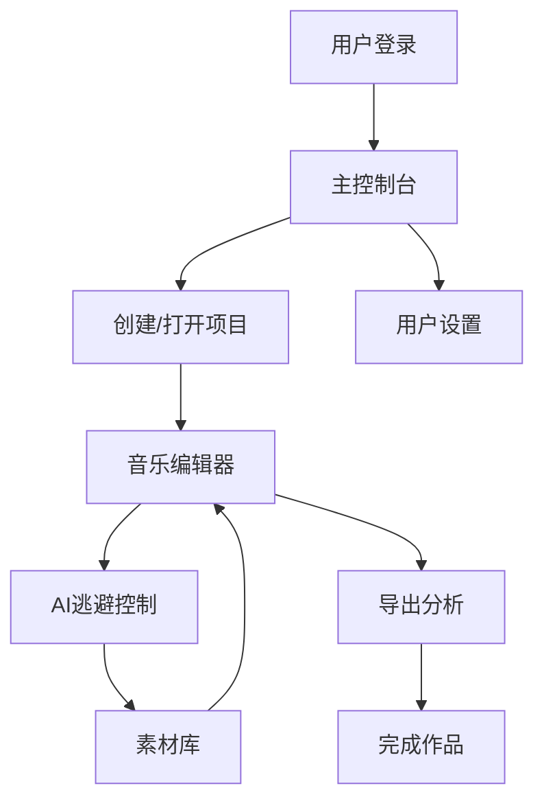

# 音乐制作软件产品需求文档

## 1. 产品概述

本产品是一款专业的音乐制作软件，旨在为用户提供完整的音乐创作工具链，同时具备先进的AI检测逃避技术，确保用户创作的音乐作品能够通过各种AI检测系统的审查。

该软件面向音乐制作人、独立音乐人和内容创作者，帮助他们创作出既具有创意又能规避AI检测的高质量音乐作品。

产品目标是成为市场上首款集成AI逃避技术的专业音乐制作平台，为用户提供安全可靠的音乐创作环境。

## 2. 核心功能

### 2.1 用户角色

| 角色 | 注册方式 | 核心权限 |
|------|----------|----------|
| 普通用户 | 邮箱注册 | 基础音乐制作功能，有限的AI逃避特性 |
| 专业用户 | 付费升级 | 完整音乐制作套件，高级AI逃避算法，云端存储 |
| 企业用户 | 商务合作 | 批量处理，API接口，定制化AI逃避策略 |

### 2.2 功能模块

我们的音乐制作软件包含以下主要页面：

1. **主控制台页面**：项目管理、快速创建、AI检测状态监控
2. **音乐编辑器页面**：多轨道编辑、音频处理、MIDI编辑、效果器链
3. **AI逃避控制页面**：检测算法分析、逃避策略配置、实时优化建议
4. **素材库页面**：音频样本、MIDI模板、预设效果、AI安全素材
5. **导出分析页面**：格式转换、质量分析、AI检测预测、安全性评估
6. **用户设置页面**：账户管理、偏好设置、订阅管理

### 2.3 页面详情

| 页面名称 | 模块名称 | 功能描述 |
|----------|----------|----------|
| 主控制台页面 | 项目管理 | 创建、打开、删除音乐项目，项目模板选择 |
| 主控制台页面 | AI状态监控 | 实时显示当前项目的AI检测风险等级和建议 |
| 主控制台页面 | 快速工具 | 一键导入、快速混音、智能母带处理 |
| 音乐编辑器页面 | 多轨道编辑 | 音频轨道录制、编辑、剪切、拼接、音量调节 |
| 音乐编辑器页面 | MIDI编辑器 | 音符编辑、速度调节、音色选择、和弦进行 |
| 音乐编辑器页面 | 效果器链 | 混响、延迟、压缩、均衡器、失真等音频效果 |
| 音乐编辑器页面 | 实时预览 | 播放控制、循环播放、节拍器、波形显示 |
| AI逃避控制页面 | 检测分析 | 分析当前音乐的AI检测特征和风险点 |
| AI逃避控制页面 | 策略配置 | 选择和配置不同的AI逃避算法和参数 |
| AI逃避控制页面 | 优化建议 | 基于AI分析提供音乐修改建议和替代方案 |
| 素材库页面 | 音频样本 | 分类浏览和搜索各种乐器、人声、环境音效样本 |
| 素材库页面 | MIDI模板 | 预制的和弦进行、节奏模式、旋律片段 |
| 素材库页面 | AI安全素材 | 经过AI检测验证的安全音频素材和模板 |
| 导出分析页面 | 格式转换 | 支持WAV、MP3、FLAC等多种音频格式导出 |
| 导出分析页面 | 质量分析 | 音频质量检测、动态范围分析、频谱分析 |
| 导出分析页面 | AI检测预测 | 预测导出音频通过各种AI检测系统的概率 |
| 用户设置页面 | 账户管理 | 个人信息、密码修改、订阅状态查看 |
| 用户设置页面 | 偏好设置 | 界面主题、快捷键配置、默认参数设置 |

## 3. 核心流程

**普通用户流程：**
用户注册登录后，在主控制台创建新项目或打开现有项目。进入音乐编辑器进行音乐创作，包括录制音频、编辑MIDI、添加效果器等。在创作过程中，AI逃避控制页面会实时分析音乐的AI检测风险，并提供优化建议。用户可以从素材库选择安全的音频素材。完成创作后，在导出分析页面进行最终的AI检测预测和质量分析，确保音乐既符合质量要求又能通过AI检测。

**专业用户流程：**
专业用户除了拥有普通用户的所有功能外，还可以访问高级AI逃避算法，进行更精细的参数调节。可以批量处理多个项目，使用云端存储同步项目文件，并获得优先的技术支持。

## 4. 用户界面设计

### 4.1 设计风格

- **主色调**：深蓝色 (#1a1a2e) 和紫色 (#16213e)，营造专业和科技感
- **辅助色**：橙色 (#ff6b35) 用于重要按钮和警告，绿色 (#4ecdc4) 用于成功状态
- **按钮样式**：圆角矩形设计，具有微妙的渐变效果和悬停动画
- **字体**：主要使用 Roboto 字体，代码区域使用 Fira Code，中文使用思源黑体
- **布局风格**：现代化卡片式布局，左侧导航栏，顶部工具栏设计
- **图标风格**：线性图标配合填充图标，统一的音乐和科技主题图标集

### 4.2 页面设计概览

| 页面名称 | 模块名称 | UI元素 |
|----------|----------|--------|
| 主控制台页面 | 项目管理 | 卡片式项目列表，悬浮创建按钮，搜索过滤器，网格/列表切换 |
| 主控制台页面 | AI状态监控 | 圆形进度指示器，颜色编码风险等级，实时更新动画 |
| 音乐编辑器页面 | 多轨道编辑 | 水平时间轴，垂直轨道列表，波形可视化，拖拽操作 |
| 音乐编辑器页面 | 效果器链 | 模块化效果器卡片，参数旋钮，实时频谱显示 |
| AI逃避控制页面 | 检测分析 | 雷达图显示风险分布，热力图标注问题区域，建议列表 |
| AI逃避控制页面 | 策略配置 | 滑块参数控制，预设策略选择器，实时预览窗口 |
| 素材库页面 | 音频样本 | 瀑布流布局，标签过滤，试听播放器，收藏功能 |
| 导出分析页面 | 格式转换 | 格式选择下拉菜单，质量滑块，进度条，预览播放 |

### 4.3 响应式设计

产品采用桌面优先的设计策略，针对1920x1080及以上分辨率优化。同时支持平板设备的横屏使用，在移动设备上提供简化的查看和基础编辑功能。界面支持触摸操作优化，包括手势缩放、拖拽和多点触控。