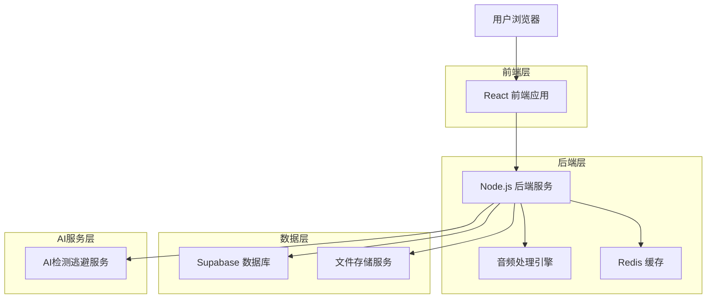
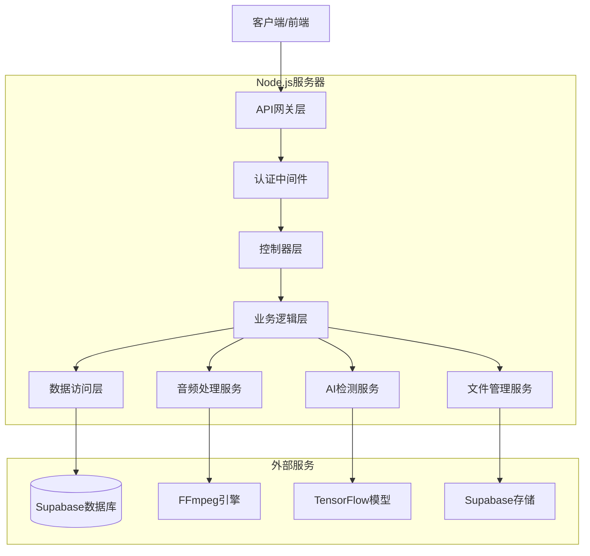
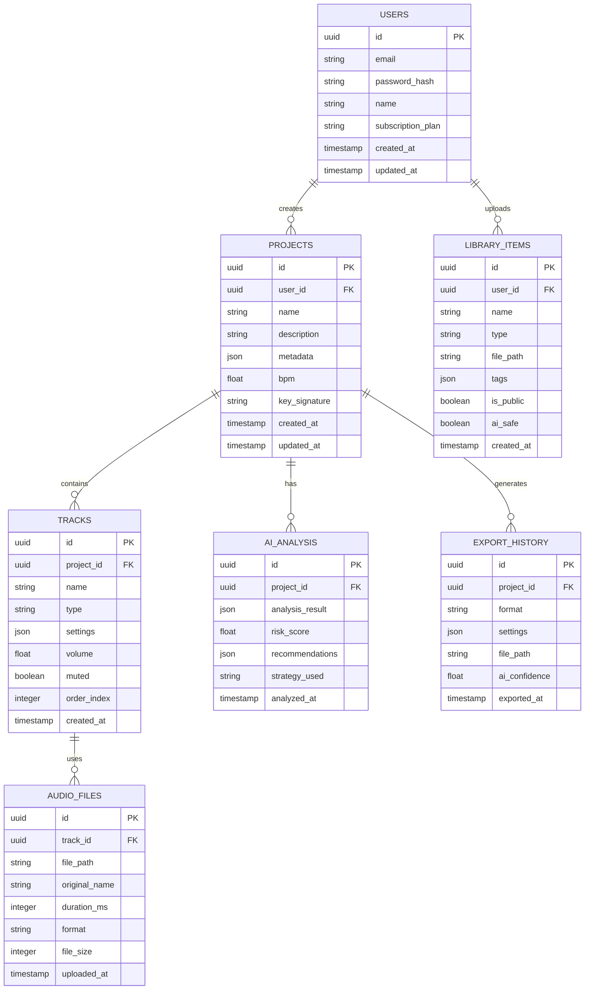

# 音乐制作软件技术架构文档

## 1. 架构设计



## 2. 技术描述

* 前端：React\@18 + TypeScript + Tailwind CSS + Vite + Web Audio API

* 后端：Node.js\@20 + Express\@4 + TypeScript

* 数据库：Supabase (PostgreSQL)

* 缓存：Redis\@7

* 音频处理：Web Audio API + Tone.js + FFmpeg

* AI服务：Python FastAPI + TensorFlow + PyTorch

* 文件存储：Supabase Storage

## 3. 路由定义

| 路由                     | 用途                   |
| ---------------------- | -------------------- |
| /                      | 主控制台页面，显示项目管理和AI状态监控 |
| /login                 | 用户登录页面               |
| /register              | 用户注册页面               |
| /editor/:projectId     | 音乐编辑器页面，多轨道编辑和MIDI编辑 |
| /ai-control/:projectId | AI逃避控制页面，检测分析和策略配置   |
| /library               | 素材库页面，音频样本和MIDI模板浏览  |
| /export/:projectId     | 导出分析页面，格式转换和质量分析     |
| /settings              | 用户设置页面，账户管理和偏好设置     |
| /profile               | 用户个人资料页面             |

## 4. API定义

### 4.1 核心API

**用户认证相关**

```
POST /api/auth/login
```

请求参数：

| 参数名      | 参数类型   | 是否必需 | 描述   |
| -------- | ------ | ---- | ---- |
| email    | string | true | 用户邮箱 |
| password | string | true | 用户密码 |

响应参数：

| 参数名     | 参数类型    | 描述      |
| ------- | ------- | ------- |
| success | boolean | 登录是否成功  |
| token   | string  | JWT访问令牌 |
| user    | object  | 用户信息对象  |

示例：

```json
{
  "email": "user@example.com",
  "password": "securepassword123"
}
```

**项目管理相关**

```
GET /api/projects
POST /api/projects
PUT /api/projects/:id
DELETE /api/projects/:id
```

**音频处理相关**

```
POST /api/audio/upload
POST /api/audio/process
GET /api/audio/download/:id
```

**AI检测逃避相关**

```
POST /api/ai/analyze
POST /api/ai/optimize
GET /api/ai/strategies
```

**素材库相关**

```
GET /api/library/samples
GET /api/library/midi-templates
POST /api/library/upload
```

## 5. 服务器架构图



## 6. 数据模型

### 6.1 数据模型定义



### 6.2 数据定义语言

**用户表 (users)**

```sql
-- 创建用户表
CREATE TABLE users (
    id UUID PRIMARY KEY DEFAULT gen_random_uuid(),
    email VARCHAR(255) UNIQUE NOT NULL,
    password_hash VARCHAR(255) NOT NULL,
    name VARCHAR(100) NOT NULL,
    subscription_plan VARCHAR(20) DEFAULT 'free' CHECK (subscription_plan IN ('free', 'professional', 'enterprise')),
    created_at TIMESTAMP WITH TIME ZONE DEFAULT NOW(),
    updated_at TIMESTAMP WITH TIME ZONE DEFAULT NOW()
);

-- 创建索引
CREATE INDEX idx_users_email ON users(email);
CREATE INDEX idx_users_subscription ON users(subscription_plan);

-- 权限设置
GRANT SELECT ON users TO anon;
GRANT ALL PRIVILEGES ON users TO authenticated;
```

**项目表 (projects)**

```sql
-- 创建项目表
CREATE TABLE projects (
    id UUID PRIMARY KEY DEFAULT gen_random_uuid(),
    user_id UUID NOT NULL,
    name VARCHAR(200) NOT NULL,
    description TEXT,
    metadata JSONB DEFAULT '{}',
    bpm FLOAT DEFAULT 120.0,
    key_signature VARCHAR(10) DEFAULT 'C',
    created_at TIMESTAMP WITH TIME ZONE DEFAULT NOW(),
    updated_at TIMESTAMP WITH TIME ZONE DEFAULT NOW()
);

-- 创建索引
CREATE INDEX idx_projects_user_id ON projects(user_id);
CREATE INDEX idx_projects_created_at ON projects(created_at DESC);
CREATE INDEX idx_projects_name ON projects(name);

-- 权限设置
GRANT SELECT ON projects TO anon;
GRANT ALL PRIVILEGES ON projects TO authenticated;
```

**音轨表 (tracks)**

```sql
-- 创建音轨表
CREATE TABLE tracks (
    id UUID PRIMARY KEY DEFAULT gen_random_uuid(),
    project_id UUID NOT NULL,
    name VARCHAR(100) NOT NULL,
    type VARCHAR(50) NOT NULL CHECK (type IN ('audio', 'midi', 'instrument')),
    settings JSONB DEFAULT '{}',
    volume FLOAT DEFAULT 1.0,
    muted BOOLEAN DEFAULT FALSE,
    order_index INTEGER NOT NULL,
    created_at TIMESTAMP WITH TIME ZONE DEFAULT NOW()
);

-- 创建索引
CREATE INDEX idx_tracks_project_id ON tracks(project_id);
CREATE INDEX idx_tracks_order ON tracks(project_id, order_index);

-- 权限设置
GRANT SELECT ON tracks TO anon;
GRANT ALL PRIVILEGES ON tracks TO authenticated;
```

**AI分析表 (ai\_analysis)**

```sql
-- 创建AI分析表
CREATE TABLE ai_analysis (
    id UUID PRIMARY KEY DEFAULT gen_random_uuid(),
    project_id UUID NOT NULL,
    analysis_result JSONB NOT NULL,
    risk_score FLOAT NOT NULL CHECK (risk_score >= 0 AND risk_score <= 1),
    recommendations JSONB DEFAULT '[]',
    strategy_used VARCHAR(100),
    analyzed_at TIMESTAMP WITH TIME ZONE DEFAULT NOW()
);

-- 创建索引
CREATE INDEX idx_ai_analysis_project_id ON ai_analysis(project_id);
CREATE INDEX idx_ai_analysis_risk_score ON ai_analysis(risk_score DESC);
CREATE INDEX idx_ai_analysis_analyzed_at ON ai_analysis(analyzed_at DESC);

-- 权限设置
GRANT SELECT ON ai_analysis TO anon;
GRANT ALL PRIVILEGES ON ai_analysis TO authenticated;
```

**素材库表 (library\_items)**

```sql
-- 创建素材库表
CREATE TABLE library_items (
    id UUID PRIMARY KEY DEFAULT gen_random_uuid(),
    user_id UUID NOT NULL,
    name VARCHAR(200) NOT NULL,
    type VARCHAR(50) NOT NULL CHECK (type IN ('sample', 'midi', 'preset', 'template')),
    file_path VARCHAR(500) NOT NULL,
    tags JSONB DEFAULT '[]',
    is_public BOOLEAN DEFAULT FALSE,
    ai_safe BOOLEAN DEFAULT FALSE,
    created_at TIMESTAMP WITH TIME ZONE DEFAULT NOW()
);

-- 创建索引
CREATE INDEX idx_library_items_user_id ON library_items(user_id);
CREATE INDEX idx_library_items_type ON library_items(type);
CREATE INDEX idx_library_items_public ON library_items(is_public) WHERE is_public = TRUE;
CREATE INDEX idx_library_items_ai_safe ON library_items(ai_safe) WHERE ai_safe = TRUE;

-- 权限设置
GRANT SELECT ON library_items TO anon;
GRANT ALL PRIVILEGES ON library_items TO authenticated;
```

**初始化数据**

```sql
-- 插入示例用户
INSERT INTO users (email, password_hash, name, subscription_plan) VALUES
('demo@musicmaker.com', '$2b$10$example_hash', 'Demo User', 'professional'),
('admin@musicmaker.com', '$2b$10$example_hash', 'Admin User', 'enterprise');

-- 插入示例素材
INSERT INTO library_items (user_id, name, type, file_path, tags, is_public, ai_safe) VALUES
((SELECT id FROM users WHERE email = 'admin@musicmaker.com'), 'Basic Drum Kit', 'sample', '/samples/drums/basic_kit.wav', '["drums", "acoustic"]', TRUE, TRUE),
((SELECT id FROM users WHERE email = 'admin@musicmaker.com'), 'Piano Chord Progression', 'midi', '/midi/piano_chords.mid', '["piano", "chords"]', TRUE, TRUE);
```

